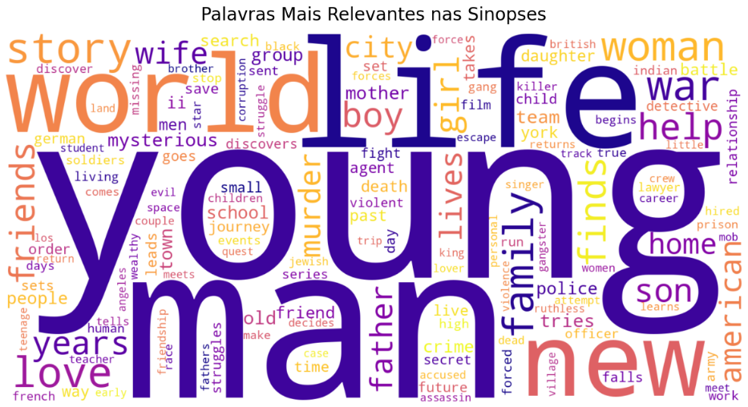

# 🎬 Desafio de Ciência de Dados - Lighthouse 2025



> É possível descobrir o gênero de um filme somente pela descrição? Esse é um dos pontos que esse projeto busca responder

# Desafio

Este repositório contém a resolução do **Desafio de Ciência de Dados 2025** da **Lighthouse/Indicium**.  
O objetivo é analisar uma base de dados cinematográfica e responder questões de negócio para orientar um estúdio de Hollywood sobre **qual tipo de filme deve ser o próximo a ser desenvolvido**.


# 💻 Tecnologias utilizadas

Antes de começar, verifique se você atendeu aos seguintes requisitos:

- Python 3.x

- Pandas, NumPy (manipulação de dados)

- Matplotlib, Seaborn (visualização)

- Scikit-learn (modelagem e métricas)

- Jupyter Notebook (documentação do processo)

# 🚀 Como instalar
Para instalar o projeto, siga estas etapas:

### Pré-requisitos 
- Instalação do python 3 🐍

### Clonar repositório 

```
https://github.com/renancarneiro/LH_CD_RENANCARNEIRO.git
```


Linux e macOS:

```
python3 -m venv .venv
source .venv/bin/activate
```

Windows:

```
python -m venv .venv
.venv\Scripts\Activate
```

### Instalando dependências
```
pip install -r requirements.txt
```


### Executando notebook
```
jupyter notebook
```

# Dicionário de dados

| Coluna               | Descrição                                                |
| ----------------- | ---------------------------------------------------------------- |
| Series_Title        | Nome do filme |
| Released_Year       |  Ano de lançamento |
| Certificate       | Classificação etária |
| Runtime       | Tempo de duração |
| Genre       | Gênero |
| IMDB_Rating       | Nota do IMDB |
| Overview       | Overview do filme |
| Meta_score       | Média ponderada de todas as críticas |
| Director       | Diretor |
| Star1       | Ator/atriz #1 |
| Star2       | Ator/atriz #2 |
| Star3       | Ator/atriz #3 |
| Star4       | Ator/atriz #4 |
| No_of_Votes       | Número de votos |
| Gross       | Faturamento |


## 👨‍💻 Sobre mim

Desenvolvedor Pleno com 3 anos de experiência migrando para a carreira de **Dados/IA**  

Explorando Data Science, Machine Learning e Inteligência Artificial  
> **“Em Deus confiamos. Todos os outros devem trazer dados.”**  – W. Edwards Deming


<table>
  <tr>
    <td align="center">
      <a href="https://www.linkedin.com/in/renancc" title="Renan Carneiro">
        <br>
        <sub>
          <b>Renan Carneiro</b>
        </sub>
      </a>
    </td>

  </tr>
</table>